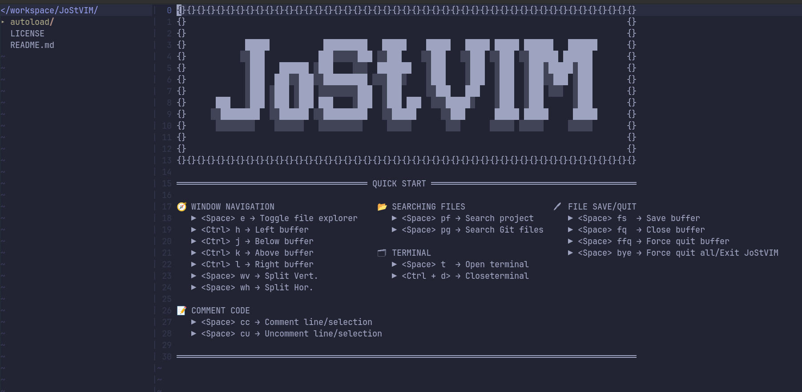

# JoStVIM - A Customized VIM Environment for Java Development

## Overview

Welcome to **JoStVIM**, a personal VIM configuration designed to create a clear, concise, and easy entry point for using VIM as a Java development environment. This project not only aims to enhance my understanding of VIM, but also to provide a highly efficient and user-friendly VIM setup that caters specifically to Java development need.

## Purpose

As a newcomer to VIM, this project is a step towards improving my workflow and learning more about the powerful customization features VIM offers. 

The goal of this setup is not only to create an environment that I am comfortable working in, but also to provide an easy-to-use entry point for others looking to use VIM for Java development.

## Special Thanks

A special thanks to the following plugins that are currently utilized in this project

- **[fzf](https://github.com/junegunn/fzf)**: A general-purpose command-line fuzzy finder that integrates perfectly with VIM to quickly search for files, buffers, and more.
- **[fzf.vim](https://github.com/junegunn/fzf.vim)**: Provides key bindings and commands to work with `fzf` inside VIM, making file and buffer navigation seamless.
- **[vim-smoothie](https://github.com/psliwka/vim-smoothie)**: Provides smooth scrolling functionality in VIM, making the scrolling experience more fluid and pleasant.
- **[NERDTree](https://github.com/preservim/nerdtree)**: A tree explorer plugin for VIM, allowing easy navigation of files and directories within the editor.

## Disclaimer

:construction: This project is a work in progress and mappings could change as I add to it...I'll try to call out any mapping changes as I go. :construction:

## License

This project is licensed under the MIT License - see the [LICENSE](LICENSE) file for details.
